# Dionaea Honeypot Using MHN-ADMIN and Google Cloud Compute

***For this Honeypot, we will be using Google Cloud Compute and the Google Cloud SDK on Windows.***

## MHN-Admin Deployment

**Summary:** We'll be using GCP to deploy a MHN-Admin Environment for our Honeypot.

You can setup a free trial at: `https://cloud.google.com/compute`

**To start off, we'll be creating the open ports necessary to configure MHN Admin (WINDOWS GOOGLE CLOUD SDK)**
`In the case that you're using Linux, replace the "^" with "\"`
```
gcloud compute firewall-rules create http ^
    --allow tcp:80 ^
    --description="Allow HTTP from Anywhere" ^
    --direction ingress ^
    --target-tags="mhn-admin"
```
```
gcloud compute firewall-rules create honeymap ^
    --allow tcp:3000 ^
    --description="Allow HoneyMap Feature from Anywhere" ^
    --direction ingress ^
    --target-tags="mhn-admin"
```
```
gcloud compute firewall-rules create hpfeeds ^
    --allow tcp:10000 ^
    --description="Allow HPFeeds from Anywhere" ^
    --direction ingress ^
    --target-tags="mhn-admin"
```

**Next we'll run the command that setups the VM in GCP**

```
gcloud compute instances create "mhn-admin" ^
    --machine-type "n1-standard-1" ^
    --subnet "default" ^
    --maintenance-policy "MIGRATE" ^
    --tags "mhn-admin" ^
    --image-family "ubuntu-minimal-1804-lts" ^
    --image-project "ubuntu-os-cloud" ^
    --boot-disk-size "10" ^
    --boot-disk-type "pd-standard" ^
    --boot-disk-device-name "mhn-admin"
```

**After running these commands, we'll connect to our VM using SSH**


	gcloud compute ssh mhn-admin


**Once we SSH into the VM, we're going to install the MHN Admin Application**

**First we will retrieve the latest packages using:**

	sudo apt update && sudo apt install git python-magic -y
	
**Second, we'll be pulling MHN from github and running the shell file (one at a time)**

	cd /opt/
	
	sudo git clone https://github.com/pwnlandia/mhn.git
	
	cd mhn/
		
	sudo sed -i 's/Flask-SQLAlchemy==2.3.2/Flask-SQLAlchemy==2.5.1/g' server/requirements.txt
		
	sudo ./install.sh

**After this, it'll have you create give you "Y/N" prompts. Hit N for every single prompt.**

	Superuser Email: Use Any Email.
	Superuser password: Use any password of your choosing.
	
***As stated before, hit n for the rest of the prompts. This process should take anywhere from 5-15 minutes.***
**Now you have created a mhn-admin VM and are ready to create the Honeypot**

#### MHN Admin Visual Example
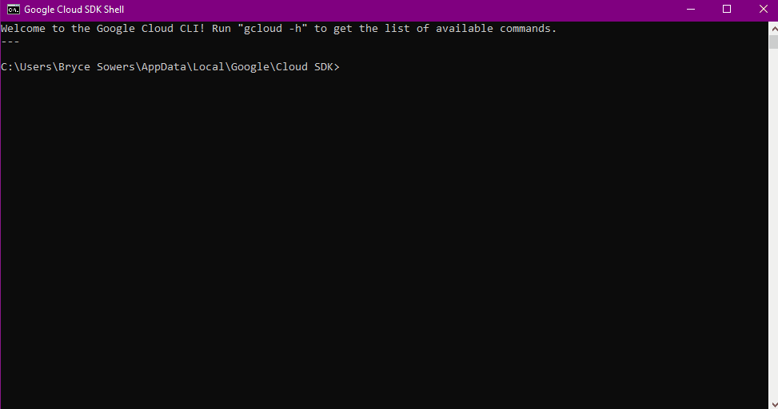

**The gif below shows you how to access the MHN-Admin website console using the username and password you created.**

#### MHN Admin Website Visual Example
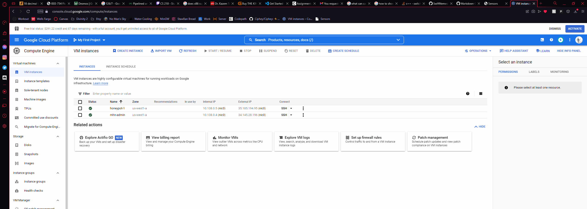

## Dionaea Honeypot Deployment 

**Summary:** Alongside the MHN-Admin, we'll be deploying a Dionaea Honeypot. This Honeypot will collect malware and attack data through the MHN application through using all open ports.

**Lets create a honeypot tagged firewall with all open ports**

	gcloud compute firewall-rules create wideopen ^
		--description="Allow TCP and UDP from Anywhere" ^
		--direction ingress ^
		--priority=1000 ^
		--network=default ^
		--action=allow ^
		--rules=tcp,udp ^
		--source-ranges=0.0.0.0/0 ^
		--target-tags="honeypot"

**Now let's create the first honeypot**

	gcloud compute instances create "honeypot-1" ^
		--machine-type "n1-standard-1" ^
		--subnet "default" ^
		--maintenance-policy "MIGRATE" ^
		--tags "honeypot" ^
		--image-family "ubuntu-minimal-1804-lts" ^
		--image-project "ubuntu-os-cloud" ^
		--boot-disk-size "10" ^
		--boot-disk-type "pd-standard" ^
		--boot-disk-device-name "honeypot-1"

**In order to access the newly created honeypot, you can do the same as before with SSH.**

`gcloud compute ssh honeypot-1`

#### Honeypot SSH Visual Example
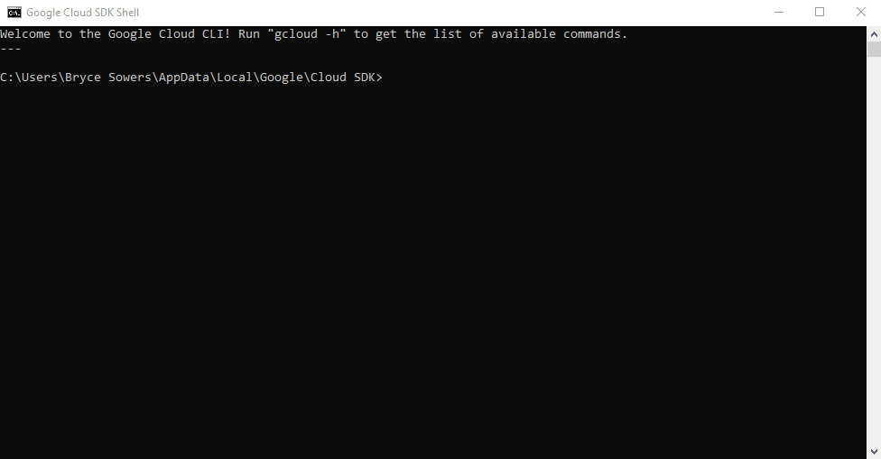

**Now we're going to install the honeypot application.**

`In order to do so, we're going to use the "Ubuntu/Raspberry Pi - Dionaea" deploy command under Deploy on your MHN Server`

**Here is an example command:**

```
wget "http://x.x.x.x/api/script/?text=true&script_id=2" -O deploy.sh && sudo bash deploy.sh http://x.x.x.x LwvoSENw
```

`x.x.x.x = The IP address of your MHN Admin VM`

**Now that it's installed, look under the Sensors tab on your MHN-admin website. Honeypot-1 should appear**

#### Honeypot Sensor Visual Example
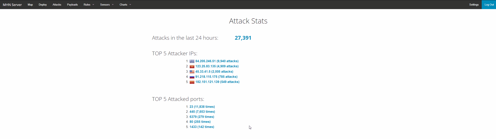


## Database Backup

**Summary:** We will export the data records from the honeypots. It stores itself in a MongoDB format in a session.json file we will create.

**First, we will SSH back into the mhn-admin VM**

`gcloud compute ssh mhn-admin`

**Second, we will run this command to export the MongoDB information to a session.json file in our working directory**

	mongoexport --db mnemosyne --collection session > session.json

**Lastly, In order to get the session.json file on our computer, we will use SCP to transfer the file.**

`gcloud compute scp mhn-admin:~/session.json ./session.json`

**IF THAT DOES NOT WORK, USE THE COMMAND BELOW**

`gcloud compute scp mhn-admin:/home/"your username"/session.json ./session.json`

**In your Session.json file, the lines should look like this from the MongoDB**

```
{"_id":{"$oid":"626f8a77616a1e65181af2e2"},"protocol":"pcap","hpfeed_id":{"$oid":"626f8a75616a1e65181af2e1"},"timestamp":{"$date":"2022-05-02T07:38:29.651Z"},"source_ip":"81.17.23.138","source_port":52835,"destination_port":81,"identifier":"c22872be-c9ea-11ec-a047-42010a8a0004","honeypot":"dionaea"}
```

#### Data Backup Visual Example
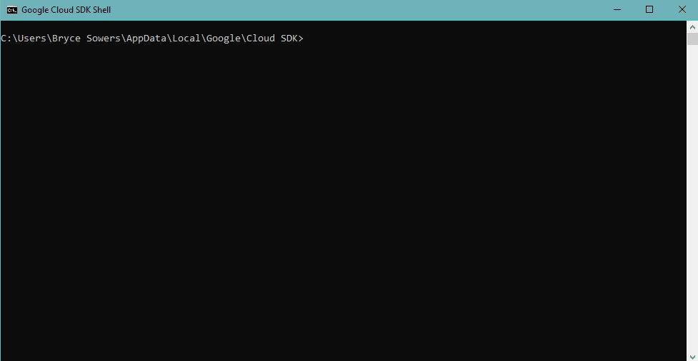

## Deploying Additional Honeypots

**Summary:** Now we are going to create two additional Honeypots. This is a pretty simple process

**To start off, we will be rerunning the commands from the original honeypot with slightly different naming.**

	gcloud compute instances create "honeypot-2" ^
		--machine-type "n1-standard-1" ^
		--subnet "default" ^
		--maintenance-policy "MIGRATE" ^
		--tags "honeypot" ^
		--image-family "ubuntu-minimal-1804-lts" ^
		--image-project "ubuntu-os-cloud" ^
		--boot-disk-size "10" ^
		--boot-disk-type "pd-standard" ^
		--boot-disk-device-name "honeypot-2"
		
	gcloud compute instances create "honeypot-3" ^
		--machine-type "n1-standard-1" ^
		--subnet "default" ^
		--maintenance-policy "MIGRATE" ^
		--tags "honeypot" ^
		--image-family "ubuntu-minimal-1804-lts" ^
		--image-project "ubuntu-os-cloud" ^
		--boot-disk-size "10" ^
		--boot-disk-type "pd-standard" ^
		--boot-disk-device-name "honeypot-3"
		
**Next, we have to ssh into each honeypot respectively**

`gcloud compute ssh honeypot-2`

`gcloud compute ssh honeypot-3`
	
**Next, we have to install the sensors once again using the wget command line for each honeypot**

```
wget "http://x.x.x.x/api/script/?text=true&script_id=2" -O deploy.sh && sudo bash deploy.sh http://x.x.x.x LwvoSENw
```

`x.x.x.x = The IP address of your MHN Admin VM`
	
#### Multi Honeypot Deployment Visual Example


## Extra: Run your own NMAP Attack

**As a side example, you can run your own nmap attacks on your honeypot**
	
	nmap -A -T4 x.x.x.x
	
`x.x.x.x is the honeypot ip address listed on GCP or the MHN-ADMIN Sensor panel`

The NMAP attack can take anywhere from 5-15 minutes, so don't be discouraged if it's taking a long time. 
You can also hit space bar in the console to see the progress it is at.

#### NMAP Attack Visual Example

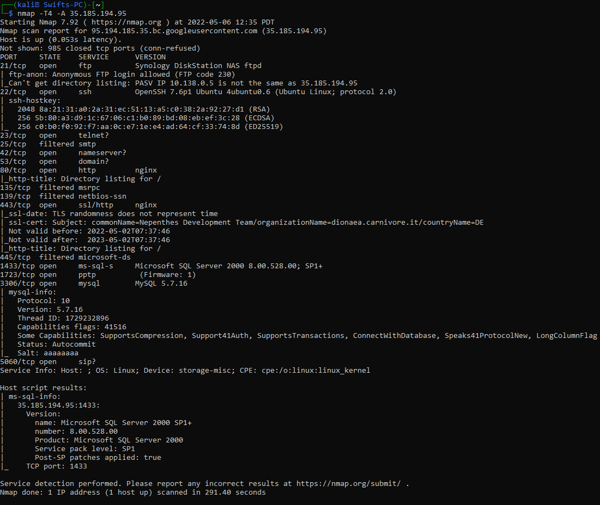

## Malware Capture and Identification

**Summary:** We will finding the malware that was captured by the dinoaea honeypot, 
and then checking it against the [VirusTotal](https://www.virustotal.com/gui/home/search) database and [ClamAV](https://www.clamav.net) (OpenSource Antivirus)

It should be stored in `/opt/dionaea/var/lib/dionaea/binaries/`

As we can see below, running ClamAV allowed us to see how many traces of Malware it recognized. 
It missed about 3 traces of malware, which is room for concern.

**OF NOTE:** a majority of these are actually WannaCry which is an extremely common self duplicating randomware worm.

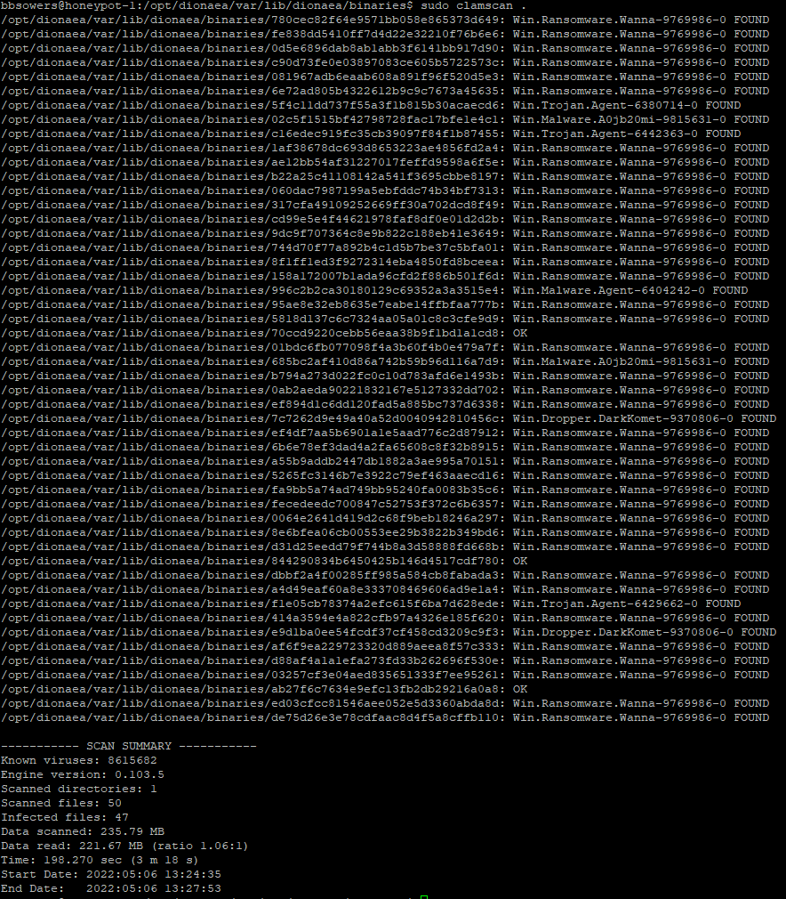

Lets analyze the 3 that it missed.

In order to find the Hashes of the file, run these commands.

```
sudo md5sum fileName
sudo sha1sum fileName
sudo sha256sum fileName
```
You may or may not need sudo depending on the permissions of the folder.

### 1st Strand of Malware

MD5 Hash: *70ccd9220cebb56eaa38b9f1bd1a1cd8*

SHA1 Hash: *17ebd69cc7302fe5b44015386054eb87fe73c3ce*

SHA256 Hash: *815eccf206bc39d67ad9c903c823cc76c59ebb5e0e24ff1028b5242c53686a3a*

This is the result found on VirusTotal by searching the associated md5 hash.

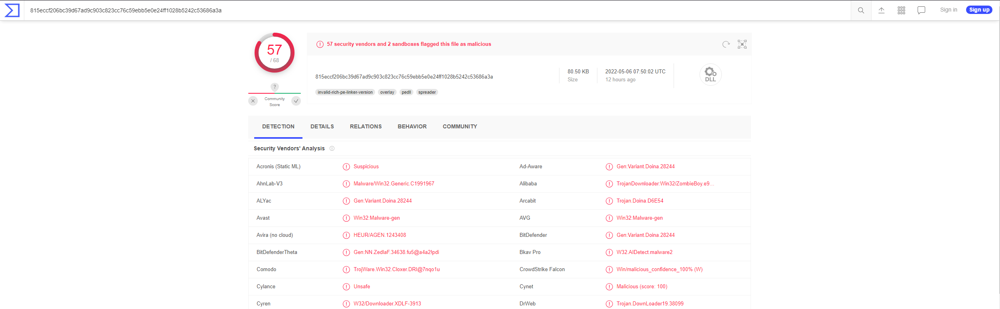

This one was not caught by ClamAV, but in most scenarios it is caught. Let's see what's in store for the 2nd strand!

### 2nd Strand of Malware

MD5 Hash: *844290834b6450425b146d4517cdf780*

SHA1 Hash: *df70cdb324a653a02d77c7b7cdc1e595852c5200*

SHA256 Hash: *303a36a13238eaaa8ac4241252225db319f47d4f12567084dc2e1c08c98e4c90*

This is the result found on VirusTotal by searching the associated md5 hash.

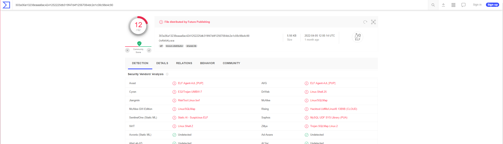

In this scenario, this is an ELF type of malware. For further information on ELF, you can checkout 
[intezer](https://www.intezer.com/blog/malware-analysis/elf-malware-analysis-101-linux-threats-no-longer-an-afterthought/).
There's a big challenge with analyzing ELF malware. There's not tons of documentation on it and it's easy to get lost in. 
It's also not heavily detected by antimalware services. As we saw in the example, there was only about 12/62 antiviruses that have
this ELF malware stored in their database. It's a linux based malware that has remained off the radar in a lot of scenarios.

As shown in the article on intezer, ELF malware uses 1 of 3 exploits to break into a system.

**1. Vulnerability exploit**

A lot of what ELF malware targets is misconfiguration, as well as exploits such as SQLi in order to dump databases or break into systems. 

**2. Valid Credentials**

Along with this, misconfiguration can play a big part in being infected with ELF. It can take advantage of valid credentials, whether it's compromised 
or credentials from the software default. This can be used to access things like SSH and maybe cause a priviledge escalation issue.

**3. Trusted realtionships abuse**

With valid credentials, it can also be exploited on the side of third party organizations that have direct access to the target system. 
This is also a concern for priviledge escalation once a server is compromised. It can be used to get valid credentials that can then target 
weaker targets below said credentials.

Sourced from [Intezer](https://www.intezer.com/blog/malware-analysis/elf-malware-analysis-101-linux-threats-no-longer-an-afterthought/)

This once again points out the everygrowing need to keep malware analysis a strong need within the anti-malware industry.

### 3rd Strand of Malware

MD5 Hash: *ab27f6c7634e9efc13fb2db29216a0a8*

SHA1 Hash: *5ac015b797818474e64a57df9774bff984107dd5*

SHA256 Hash: *c071278f921475bc6f252b10b771dda4948596ef6d81b689bd936a2a9058b5cc*

This is the result found on VirusTotal by searching the associated md5 hash.

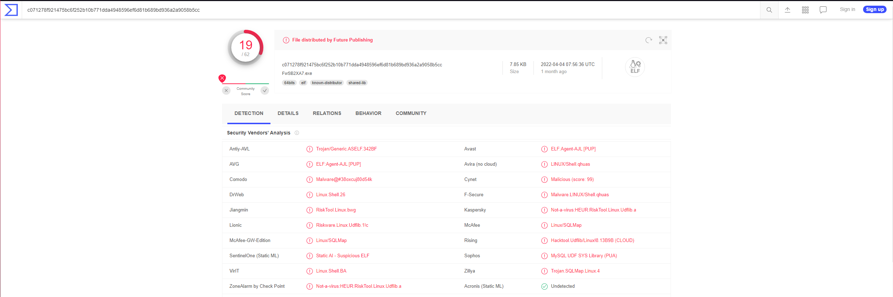

Turns out, this is also an ELF malware. If you notice, it lists it as a `PUP` under some antiviruses such as Avast. 
PUP stands for Potentially Unwanted Program, which is what I hope it would be classified as.

As shown before, only 19/62 Antivirus' detected it which is another concern. ELF is elusive as ever.


### Notes on finding captured malware (and my struggles)

During my attempt to do malware analysis, I was struggling to find the correct direction.
I found a useful command that may help you be able to find it as well if you struggle.

`sudo find / -type f -exec md5sum {} + | sudo grep '^996c2b2ca30180129c69352a3a3515e4'`

In this scenario, this line executes and finds the file with that exact md5 checksum.
You can change `/` to be whatever directory and change `'^996c2b2ca30180129c69352a3a3515e4` will be
`'^md5hash'`

Since you have the list of payloads, this can you help you find the directory it's stored in.
It should be stored in `/opt/dionaea/var/lib/dionaea/binaries/`

In order to find the count of number of files in the directory, you can use the useful command:

`ls | wc -l`

## Some extra findings and research on WannaCry

#### What is it?
WannaCry is a type of ransomeware that consists of multiple components. In 
most cases, malware that contains multiple components in injected in the form of a dropper; a self contained program that extracts the other parts of the application from within. 
There are three components.

1. An application that encrypts and decrypts data
2. Files contaning encryption keys
3. A copy of Tor

#### How does it infect?
For the WannaCry worm, it uses SMB explotation (Server Message Block) in order to infect a device or server. 
According to an article written on CSO, the NSA became aware of the exploit and created an exploitation called `EternalBlue`. 
This was eventually leaked and was exploited by a hacker group called `Shadow Brokers`. Microsoft was aware of the vulnerability about a month 
beforehand and had patched it, but there were still plenty of systems that were left vulnerable to `EternalBlue`.

#### What does it do?
The WannaCry ransomware is a crypto malware that encrypts important file formats such as Micoroft Office files, MP3, MKV, and other important file extensions. 
This leaves it unable to be used by the user, and usually has a ransom paid in bitcoin in order to decrypt the files. 

#### Is it still active and what has been done about it?

The WannaCry ransomware is still active in waves today, but it largely has been blundered by a sinkhole. 
This sinkhole was created by **Marcus Hutchins** and **Jamie Hankins** at the company Kryptos Logic in LA. 
WannaCry itself tries to connect to a domain in it's code, which if it cannot connect, triggers the drop to occur. 
Because of this, the two malware researchers found a kill switch built in that if it connected to the domain, it would create a sinkhole for the ransomware. 
They sucessfully did this by registering the domain, which in turn made it connect and cause WannaCry to not deploy. 
Similar to a **Logic bomb**, if the domain was connected, it would cause the malware to not deploy at all.

#### Sources:
1. [CSO](https://www.csoonline.com/article/3227906/what-is-wannacry-ransomware-how-does-it-infect-and-who-was-responsible.html)
2. [TechCrunch](https://techcrunch.com/2019/07/08/the-wannacry-sinkhole/)
3. [Mimecast](https://www.mimecast.com/blog/all-you-need-to-know-about-wannacry-ransomware/)

## Results from May 3rd-6th

In the below image, we can see here how many different types of payloads that were delievered to my VM.
It's intriguing to see how much automatic hacking there is out on the web. This does however make a great source 
for research when it comes to figuring out how to deal with malware. It's an especially plentiful 
source of data for research such as anti-malware software.

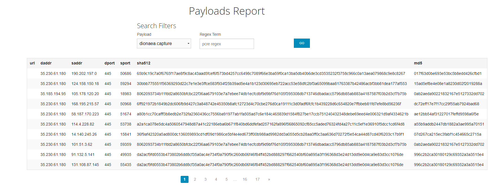

Alonside this, I captured about fifty different types of malware with all different types of MD5sum hashes.

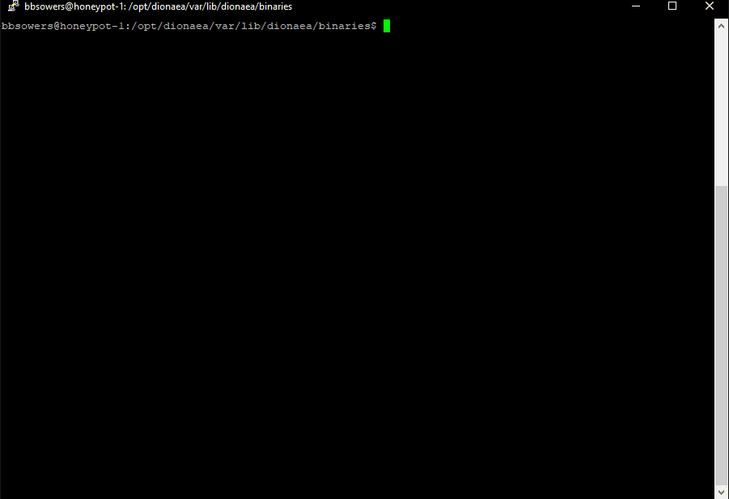

The majority of these however are WannaCry, which is the common ransomeware worm.